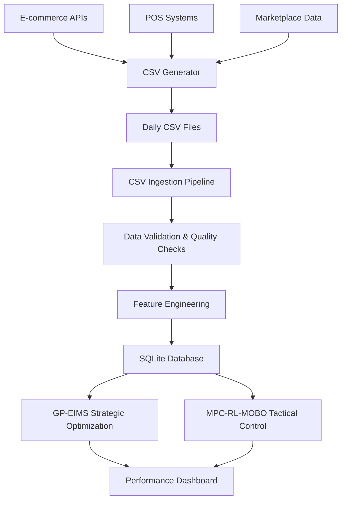

# Live Data Integration Guide

## Overview

The Stock GRIP Live Data Integration system enables real-time ingestion and processing of sales, inventory, and demand data from multiple sources including e-commerce platforms, POS systems, and marketplace APIs through a robust CSV-based pipeline.

## Architecture

### System Components



### Core Modules

1. **Live Data Models** (`src/data/live_data_models.py`)
   - Extended database schema for live data
   - Data ingestion logging and quality metrics

2. **CSV Ingestion Pipeline** (`src/data/csv_ingestion.py`)
   - Automated CSV processing with validation
   - Error handling and data type conversion

3. **Feature Engineering** (`src/data/live_feature_engineering.py`)
   - Real-time feature calculation
   - Demand velocity, channel performance, inventory health

4. **Data Quality Monitor** (`src/data/data_quality_monitor.py`)
   - Completeness, timeliness, accuracy checks
   - Anomaly detection and alerting

5. **Daily Workflow** (`src/data/daily_workflow.py`)
   - Automated orchestration
   - Scheduling and monitoring

## CSV Data Schemas

### Sales Data CSV Format

```csv
date,product_id,channel,quantity_sold,revenue,customer_segment,promotion_code,fulfillment_method
2025-01-15T10:30:00,PER-0001,online,25,125.50,premium,WINTER20,warehouse
2025-01-15T11:45:00,FOO-0002,pos,18,54.00,regular,,store_pickup
```

**Required Fields:**
- `date`: ISO format datetime (YYYY-MM-DDTHH:MM:SS)
- `product_id`: Unique product identifier
- `channel`: Sales channel (online, pos, marketplace, wholesale)
- `quantity_sold`: Number of units sold (positive integer)
- `revenue`: Total revenue (positive float)

**Optional Fields:**
- `customer_segment`: Customer type (premium, regular, budget)
- `promotion_code`: Applied promotion code
- `fulfillment_method`: Delivery method (warehouse, store_pickup, dropship)

### Inventory Data CSV Format

```csv
date,product_id,location,stock_level,reserved_stock,in_transit,supplier_id,last_reorder_date
2025-01-15T00:00:00,PER-0001,warehouse_a,150,25,50,SUP001,2025-01-10T00:00:00
2025-01-15T00:00:00,FOO-0002,store_01,75,5,0,SUP002,2025-01-12T00:00:00
```

**Required Fields:**
- `date`: ISO format datetime
- `product_id`: Unique product identifier
- `location`: Storage location identifier
- `stock_level`: Current stock quantity (non-negative integer)

**Optional Fields:**
- `reserved_stock`: Reserved inventory (default: 0)
- `in_transit`: Inventory in transit (default: 0)
- `supplier_id`: Supplier identifier
- `last_reorder_date`: Last reorder date

### Demand Signals CSV Format

```csv
date,product_id,external_demand,market_trend,competitor_price,weather_factor,event_impact,social_sentiment
2025-01-15T00:00:00,PER-0001,high,0.15,22.99,normal,none,0.3
2025-01-15T00:00:00,FOO-0002,medium,-0.05,8.50,cold,promotion,0.1
```

**Required Fields:**
- `date`: ISO format datetime
- `product_id`: Unique product identifier
- `external_demand`: Demand level (high, medium, low)

**Optional Fields:**
- `market_trend`: Market trend indicator (-1.0 to 1.0)
- `competitor_price`: Competitor pricing data
- `weather_factor`: Weather impact (hot, cold, rainy, normal)
- `event_impact`: Event influence (promotion, holiday, none)
- `social_sentiment`: Social media sentiment (-1.0 to 1.0)

## Setup and Configuration

### 1. Database Setup

```python
from src.data.models import create_database
from src.data.live_data_models import Base
from config.settings import DATABASE_URL

# Create database with live data tables
engine = create_database(DATABASE_URL)
Base.metadata.create_all(engine)
```

### 2. Directory Structure

Create the following directories:

```
data/
├── live_feeds/          # Incoming CSV files
├── processed/           # Successfully processed files
├── errors/              # Failed processing files
└── reports/             # Generated reports

logs/                    # System logs
```

### 3. Configuration

Update `config/settings.py`:

```python
# Live data configuration
LIVE_DATA_CONFIG = {
    'data_retention_days': 90,
    'quality_check_enabled': True,
    'feature_engineering_enabled': True,
    'notification_enabled': False,
    'max_processing_time_minutes': 60,
    'retry_attempts': 3
}
```

## Usage Examples

### Manual CSV Processing

```python
from src.data.csv_ingestion import CSVIngestionPipeline

# Initialize pipeline
pipeline = CSVIngestionPipeline()

# Process single file
result = pipeline.process_csv_file('data/live_feeds/sales_data_20250115.csv', 'sales')

# Process all files in directory
results = pipeline.process_daily_files()
```

### Data Quality Monitoring

```python
from src.data.data_quality_monitor import DataQualityMonitor
from sqlalchemy import create_engine
from src.data.models import get_session

engine = create_engine(DATABASE_URL)
session = get_session(engine)

monitor = DataQualityMonitor(session)
quality_results = monitor.run_comprehensive_quality_check()

print(f"Overall Status: {quality_results['overall_status']}")
```

### Feature Engineering

```python
from src.data.live_feature_engineering import LiveFeatureEngineer

feature_engineer = LiveFeatureEngineer(session)
features = feature_engineer.create_comprehensive_feature_set('PER-0001')

print(f"Generated {len(features)} features for product PER-0001")
```

### Automated Daily Workflow

```python
from src.data.daily_workflow import WorkflowOrchestrator

# Run once
orchestrator = WorkflowOrchestrator()
result = orchestrator.run_daily_workflow()

# Schedule daily execution at 2:00 AM
orchestrator.schedule_daily_workflow("02:00")
```

## Data Source Integration

### E-commerce Platform Integration

#### Shopify Integration Example

```python
import shopify
import pandas as pd
from datetime import datetime

def extract_shopify_sales(shop_url, access_token, date):
    """Extract sales data from Shopify"""
    shopify.ShopifyResource.set_site(f"https://{shop_url}")
    shopify.ShopifyResource.set_headers({"X-Shopify-Access-Token": access_token})
    
    # Get orders for the date
    orders = shopify.Order.find(created_at_min=date, created_at_max=date + timedelta(days=1))
    
    sales_data = []
    for order in orders:
        for line_item in order.line_items:
            sales_record = {
                'date': order.created_at,
                'product_id': line_item.sku,
                'channel': 'online',
                'quantity_sold': line_item.quantity,
                'revenue': float(line_item.price) * line_item.quantity,
                'customer_segment': 'regular',
                'promotion_code': order.discount_codes[0].code if order.discount_codes else '',
                'fulfillment_method': 'warehouse'
            }
            sales_data.append(sales_record)
    
    # Save to CSV
    df = pd.DataFrame(sales_data)
    filename = f"data/live_feeds/sales_data_{date.strftime('%Y%m%d')}.csv"
    df.to_csv(filename, index=False)
    
    return filename
```

#### Square POS Integration Example

```python
import squareup
from squareup.models import SearchOrdersRequest, SearchOrdersQuery

def extract_square_sales(access_token, location_id, date):
    """Extract sales data from Square POS"""
    client = squareup.Client(access_token=access_token, environment='production')
    orders_api = client.orders
    
    # Search for orders
    query = SearchOrdersQuery(
        filter=SearchOrdersFilter(
            date_time_filter=SearchOrdersDateTimeFilter(
                created_at=TimeRange(
                    start_at=date.isoformat(),
                    end_at=(date + timedelta(days=1)).isoformat()
                )
            ),
            location_filter=SearchOrdersLocationFilter(location_ids=[location_id])
        )
    )
    
    request = SearchOrdersRequest(query=query)
    result = orders_api.search_orders(body=request)
    
    sales_data = []
    if result.is_success():
        orders = result.body.get('orders', [])
        for order in orders:
            for line_item in order.get('line_items', []):
                sales_record = {
                    'date': order['created_at'],
                    'product_id': line_item.get('catalog_object_id', ''),
                    'channel': 'pos',
                    'quantity_sold': int(line_item['quantity']),
                    'revenue': float(line_item['total_money']['amount']) / 100,  # Convert from cents
                    'customer_segment': 'regular',
                    'promotion_code': '',
                    'fulfillment_method': 'store_pickup'
                }
                sales_data.append(sales_record)
    
    # Save to CSV
    df = pd.DataFrame(sales_data)
    filename = f"data/live_feeds/sales_data_{date.strftime('%Y%m%d')}.csv"
    df.to_csv(filename, index=False)
    
    return filename
```

### Automated Data Collection Script

```python
#!/usr/bin/env python3
"""
Daily data collection script for multiple sources
"""
import schedule
import time
from datetime import datetime, timedelta

def collect_daily_data():
    """Collect data from all configured sources"""
    date = datetime.utcnow().date()
    
    try:
        # Shopify data
        if SHOPIFY_ENABLED:
            extract_shopify_sales(SHOPIFY_SHOP_URL, SHOPIFY_ACCESS_TOKEN, date)
        
        # Square POS data
        if SQUARE_ENABLED:
            extract_square_sales(SQUARE_ACCESS_TOKEN, SQUARE_LOCATION_ID, date)
        
        # Custom inventory system
        if INVENTORY_API_ENABLED:
            extract_inventory_data(INVENTORY_API_URL, INVENTORY_API_KEY, date)
        
        print(f"Data collection completed for {date}")
        
    except Exception as e:
        print(f"Data collection failed: {e}")

# Schedule daily collection at 1:00 AM
schedule.every().day.at("01:00").do(collect_daily_data)

if __name__ == "__main__":
    while True:
        schedule.run_pending()
        time.sleep(60)
```

## Monitoring and Alerting

### Quality Metrics Dashboard

The system tracks the following quality metrics:

1. **Completeness**: Percentage of expected data received
2. **Timeliness**: Hours since last data update
3. **Accuracy**: Percentage of valid records
4. **Consistency**: Logical consistency across data sources
5. **Anomaly Score**: Statistical deviation from normal patterns

### Alert Conditions

- **Critical**: Data completeness < 90%
- **Warning**: Data delay > 24 hours
- **Info**: Anomaly score > 2.0 standard deviations

### Email Notifications

Configure email notifications in `daily_workflow.py`:

```python
config = {
    'notification_enabled': True,
    'notification_email': 'admin@company.com',
    'smtp_server': 'smtp.gmail.com',
    'smtp_port': 587,
    'smtp_username': 'your_email@gmail.com',
    'smtp_password': 'your_app_password'
}
```

## Performance Optimization

### Best Practices

1. **Batch Processing**: Process files in batches during off-peak hours
2. **Incremental Updates**: Only process new/changed records
3. **Parallel Processing**: Use multiple threads for large datasets
4. **Data Compression**: Compress CSV files to reduce storage
5. **Index Optimization**: Create database indexes on frequently queried columns

### Scaling Considerations

- **File Size**: Limit CSV files to 10MB for optimal processing
- **Frequency**: Daily processing recommended for most use cases
- **Retention**: Keep raw data for 90 days, aggregated data longer
- **Backup**: Regular database backups before processing

## Troubleshooting

### Common Issues

#### 1. CSV Format Errors

**Problem**: Invalid date formats or missing required columns

**Solution**: 
```python
# Check CSV schema before processing
validator = CSVValidator()
validation_result = validator.validate_schema(df, 'sales')
if not validation_result['valid']:
    print(f"Schema errors: {validation_result['errors']}")
```

#### 2. Data Quality Issues

**Problem**: Negative quantities or inconsistent inventory levels

**Solution**:
```python
# Run quality checks
monitor = DataQualityMonitor(session)
quality_result = monitor.check_data_consistency('sales')
if quality_result['status'] != 'pass':
    print(f"Quality issues: {quality_result['details']}")
```

#### 3. Processing Timeouts

**Problem**: Large files taking too long to process

**Solution**:
- Split large files into smaller chunks
- Increase timeout configuration
- Process during off-peak hours

#### 4. Database Connection Issues

**Problem**: SQLite database locks or connection errors

**Solution**:
```python
# Use connection pooling and proper session management
from sqlalchemy.pool import StaticPool

engine = create_engine(
    DATABASE_URL,
    poolclass=StaticPool,
    connect_args={'check_same_thread': False}
)
```

## Testing

### Generate Sample Data

```bash
# Generate daily sample data
python src/data/sample_data_generator.py generate

# Generate historical data (7 days)
python src/data/sample_data_generator.py generate historical 7

# Generate corrupted data for testing
python src/data/sample_data_generator.py corrupted
```

### Run Test Suite

```bash
# Run comprehensive tests
python src/data/sample_data_generator.py test
```

### Manual Testing

```python
from src.data.sample_data_generator import LiveDataTester

tester = LiveDataTester()

# Test individual components
csv_result = tester.test_csv_ingestion()
quality_result = tester.test_data_quality_monitoring()
feature_result = tester.test_feature_engineering()
workflow_result = tester.test_daily_workflow()

# Run all tests
comprehensive_result = tester.run_comprehensive_test()
```

## API Reference

### CSVIngestionPipeline

```python
class CSVIngestionPipeline:
    def process_csv_file(self, file_path: str, data_type: str) -> Dict[str, Any]
    def process_daily_files(self) -> Dict[str, Any]
```

### DataQualityMonitor

```python
class DataQualityMonitor:
    def check_data_completeness(self, data_type: str, date: datetime = None) -> Dict[str, Any]
    def check_data_timeliness(self, data_type: str) -> Dict[str, Any]
    def detect_sales_anomalies(self, lookback_days: int = 30) -> Dict[str, Any]
    def run_comprehensive_quality_check(self) -> Dict[str, Any]
```

### LiveFeatureEngineer

```python
class LiveFeatureEngineer:
    def calculate_demand_velocity_features(self, product_id: str, lookback_days: int = 30) -> Dict[str, float]
    def calculate_channel_performance_features(self, product_id: str, lookback_days: int = 30) -> Dict[str, float]
    def create_comprehensive_feature_set(self, product_id: str, lookback_days: int = 30) -> Dict[str, float]
```

### WorkflowOrchestrator

```python
class WorkflowOrchestrator:
    def run_daily_workflow(self) -> Dict[str, Any]
    def schedule_daily_workflow(self, time_str: str = "02:00")
    def get_workflow_status(self) -> Dict[str, Any]
```

## Support and Maintenance

### Log Files

- **Application Logs**: `logs/daily_workflow.log`
- **Ingestion Logs**: Database table `data_ingestion_log`
- **Quality Metrics**: Database table `data_quality_metrics`

### Maintenance Tasks

1. **Weekly**: Review data quality reports
2. **Monthly**: Clean up old log files
3. **Quarterly**: Optimize database indexes
4. **Annually**: Review and update data retention policies

### Contact Information

For technical support or questions about the live data integration system, contact the development team or refer to the main Stock GRIP documentation.