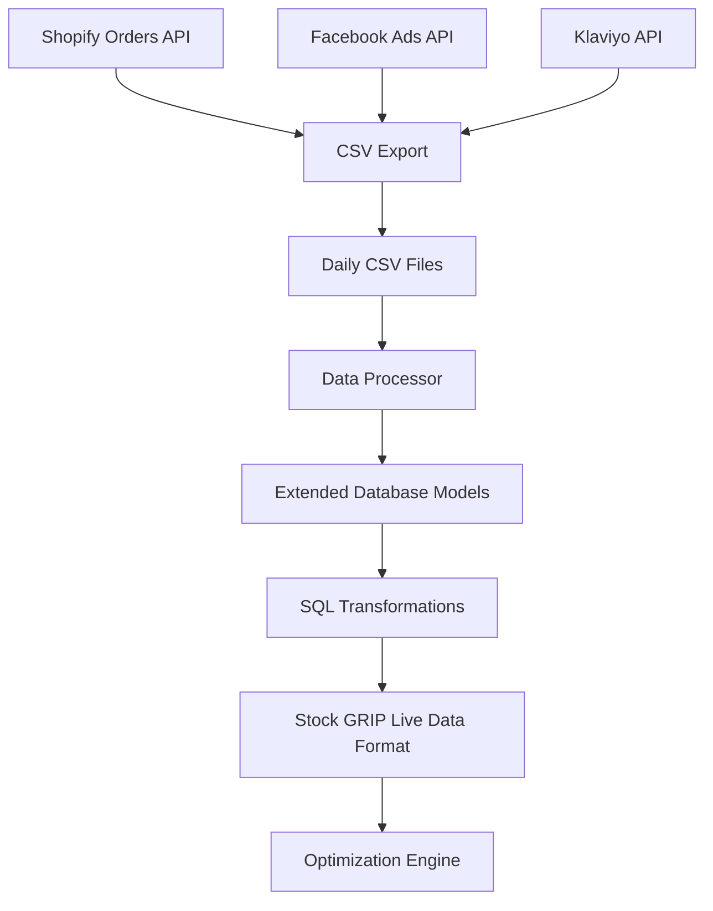

# Shopify, Facebook & Klaviyo Integration Guide

## Overview

This guide provides complete SQL data modeling and transformation code for integrating Shopify e-commerce data, Facebook Ads performance data, and Klaviyo email marketing data with the Stock GRIP inventory optimization system.

## 🎯 **Integration Architecture**



## 📊 **Data Models Created**

### 1. **Shopify Data Models**

#### ShopifyOrderData
- **Purpose**: Store complete Shopify order information
- **Key Fields**: Order totals, customer data, shipping info, marketing attribution
- **Table**: `shopify_orders`

#### ShopifyLineItemData  
- **Purpose**: Individual product line items from orders
- **Key Fields**: Product details, quantities, pricing, fulfillment status
- **Table**: `shopify_line_items`

### 2. **Facebook Ads Data Models**

#### FacebookAdsData
- **Purpose**: Facebook advertising performance metrics
- **Key Fields**: Campaign data, spend, conversions, audience targeting
- **Table**: `facebook_ads_data`

### 3. **Klaviyo Email Data Models**

#### KlaviyoEmailData
- **Purpose**: Email campaign and automation performance
- **Key Fields**: Send metrics, engagement rates, revenue attribution
- **Table**: `klaviyo_email_data`

#### KlaviyoCustomerData
- **Purpose**: Customer profiles and engagement scoring
- **Key Fields**: Lifetime value, engagement scores, segmentation
- **Table**: `klaviyo_customers`

### 4. **Unified Analytics Models**

#### IntegratedMarketingAttribution
- **Purpose**: Multi-touch attribution across all channels
- **Key Fields**: First/last touch attribution, customer journey mapping
- **Table**: `marketing_attribution`

#### ProductPerformanceAggregated
- **Purpose**: Unified product performance across all channels
- **Key Fields**: Sales, marketing spend, attribution, ROAS
- **Table**: `product_performance_aggregated`

## 📁 **CSV Schema Files**

### Required CSV Files

1. **`shopify_orders_schema.csv`**
   - Shopify order data export
   - 26 columns including customer, financial, and shipping data

2. **`shopify_line_items_schema.csv`**
   - Product line items from orders
   - 16 columns with product details and fulfillment info

3. **`facebook_ads_schema.csv`**
   - Facebook Ads performance data
   - 25 columns with campaign metrics and attribution

4. **`klaviyo_email_schema.csv`**
   - Email campaign performance data
   - 24 columns with engagement and revenue metrics

### Sample Data Included

Each CSV file contains realistic sample data with:
- **UK-specific** customer data (London, Manchester, Birmingham addresses)
- **£ currency** formatting throughout
- **Realistic product IDs** that match Stock GRIP format
- **JSON attribution** data for cross-channel analysis

## 🔧 **SQL Transformations**

### Key Transformation Views

#### 1. **Shopify Sales Transformation**
```sql
CREATE VIEW shopify_sales_transformed AS
SELECT 
    so.created_at as date,
    sli.product_id,
    'shopify' as channel,
    sli.quantity as quantity_sold,
    (sli.price * sli.quantity - sli.total_discount) as revenue,
    CASE 
        WHEN so.customer_total_spent > 1000 THEN 'premium'
        WHEN so.customer_total_spent > 500 THEN 'regular'
        ELSE 'budget'
    END as customer_segment
FROM shopify_orders so
JOIN shopify_line_items sli ON so.shopify_order_id = sli.shopify_order_id
WHERE so.financial_status = 'paid' AND so.cancelled_at IS NULL;
```

#### 2. **Facebook Product Performance**
```sql
CREATE VIEW facebook_product_performance AS
SELECT 
    date,
    JSON_EXTRACT(attributed_products, '$[*].product_id') as product_id,
    campaign_name,
    SUM(spend) as total_spend,
    SUM(purchase_value) as total_purchase_value,
    AVG(roas) as avg_roas,
    SUM(spend) / NULLIF(SUM(purchases), 0) as cost_per_purchase
FROM facebook_ads_data
WHERE attributed_products IS NOT NULL
GROUP BY date, JSON_EXTRACT(attributed_products, '$[*].product_id'), campaign_name;
```

#### 3. **Klaviyo Email Performance**
```sql
CREATE VIEW klaviyo_product_performance AS
SELECT 
    date,
    JSON_EXTRACT(featured_products, '$[*].product_id') as product_id,
    campaign_name,
    SUM(recipients) as total_recipients,
    SUM(attributed_revenue) as total_attributed_revenue,
    AVG(open_rate) as avg_open_rate,
    SUM(attributed_revenue) / NULLIF(SUM(recipients), 0) as revenue_per_recipient
FROM klaviyo_email_data
WHERE featured_products IS NOT NULL
GROUP BY date, JSON_EXTRACT(featured_products, '$[*].product_id'), campaign_name;
```

#### 4. **Unified Product Performance**
```sql
CREATE VIEW unified_product_performance AS
SELECT 
    p.product_id,
    p.name as product_name,
    COALESCE(sds.total_quantity, 0) as shopify_units_sold,
    COALESCE(sds.total_revenue, 0) as shopify_revenue,
    COALESCE(fpp.total_spend, 0) as facebook_spend,
    COALESCE(fpp.total_purchase_value, 0) as facebook_attributed_revenue,
    COALESCE(kpp.total_attributed_revenue, 0) as email_attributed_revenue,
    -- Calculate overall ROAS
    (COALESCE(sds.total_revenue, 0) + COALESCE(fpp.total_purchase_value, 0) + COALESCE(kpp.total_attributed_revenue, 0)) / NULLIF(COALESCE(fpp.total_spend, 0), 0) as overall_roas
FROM products p
LEFT JOIN shopify_daily_sales sds ON p.product_id = sds.product_id
LEFT JOIN facebook_product_performance fpp ON p.product_id = fpp.product_id
LEFT JOIN klaviyo_product_performance kpp ON p.product_id = kpp.product_id;
```

## 🚀 **Implementation Steps**

### 1. **Setup Database Models**

```python
# Create extended tables
from src.data.shopify_facebook_klaviyo_models import Base
Base.metadata.create_all(engine)
```

### 2. **Process CSV Files**

```python
from src.data.shopify_facebook_klaviyo_processor import ShopifyFacebookKlaviyoProcessor

processor = ShopifyFacebookKlaviyoProcessor()
results = processor.process_all_csv_files("data/csv_schemas")
```

### 3. **Execute SQL Transformations**

```sql
-- Run the transformation SQL file
.read sql/shopify_facebook_klaviyo_transformations.sql
```

### 4. **Verify Integration**

```python
# Test the integration
python test_shopify_facebook_klaviyo_integration.py
```

## 📈 **Key Analytics Queries**

### Daily Revenue by Channel
```sql
SELECT 
    DATE(date) as sale_date,
    channel,
    SUM(revenue) as total_revenue,
    COUNT(*) as transaction_count
FROM live_sales_data 
WHERE date >= DATE('now', '-7 days')
GROUP BY DATE(date), channel
ORDER BY sale_date DESC, total_revenue DESC;
```

### Marketing ROI Analysis
```sql
SELECT 
    product_id,
    facebook_spend,
    facebook_attributed_revenue,
    klaviyo_attributed_revenue,
    (facebook_attributed_revenue + klaviyo_attributed_revenue) / NULLIF(facebook_spend, 0) as marketing_roas
FROM product_performance_aggregated
WHERE facebook_spend > 0
ORDER BY marketing_roas DESC;
```

### Customer Lifetime Value
```sql
SELECT 
    customer_email,
    COUNT(DISTINCT source_order_id) as total_orders,
    SUM(revenue) as total_spent,
    AVG(revenue) as avg_order_value,
    MIN(date) as first_order_date,
    MAX(date) as last_order_date
FROM shopify_sales_transformed
GROUP BY customer_email
ORDER BY total_spent DESC;
```

### Email Campaign Effectiveness
```sql
SELECT 
    campaign_name,
    SUM(recipients) as total_recipients,
    AVG(open_rate) as avg_open_rate,
    SUM(attributed_revenue) as total_revenue,
    SUM(attributed_revenue) / SUM(recipients) as revenue_per_recipient
FROM klaviyo_email_data 
WHERE message_type = 'campaign'
GROUP BY campaign_name
ORDER BY revenue_per_recipient DESC;
```

## 🔍 **Data Quality Monitoring**

### Automated Quality Checks

```sql
-- Data freshness monitoring
CREATE VIEW data_freshness_monitor AS
SELECT 
    'shopify_orders' as table_name,
    COUNT(*) as total_records,
    MAX(timestamp_created) as last_update,
    COUNT(CASE WHEN DATE(timestamp_created) = DATE('now') THEN 1 END) as today_records
FROM shopify_orders
UNION ALL
SELECT 'facebook_ads_data', COUNT(*), MAX(timestamp_created), COUNT(CASE WHEN DATE(timestamp_created) = DATE('now') THEN 1 END) FROM facebook_ads_data
UNION ALL
SELECT 'klaviyo_email_data', COUNT(*), MAX(timestamp_created), COUNT(CASE WHEN DATE(timestamp_created) = DATE('now') THEN 1 END) FROM klaviyo_email_data;
```

### Data Validation Rules

1. **Revenue Validation**: No negative revenue values
2. **Spend Validation**: No negative advertising spend
3. **Engagement Validation**: Email open rates ≤ 100%
4. **Attribution Validation**: Product IDs exist in products table
5. **Date Validation**: All dates within reasonable ranges

## 🎯 **Integration with Stock GRIP**

### Automatic Data Flow

1. **CSV files** placed in `data/csv_schemas/`
2. **Processor** validates and imports data
3. **SQL transformations** create unified views
4. **Live data tables** updated for optimization
5. **GP-EIMS and MPC-RL-MOBO** use enhanced data

### Enhanced Optimization Features

- **Marketing-driven demand signals**
- **Customer segment-based forecasting**
- **Channel-specific inventory allocation**
- **ROI-optimized reorder points**
- **Attribution-based product prioritization**

## 🔧 **Testing and Validation**

### Run Complete Test Suite

```bash
# Test all integrations
python test_shopify_facebook_klaviyo_integration.py

# Test individual components
python test_shopify_facebook_klaviyo_integration.py test

# Show SQL examples
python test_shopify_facebook_klaviyo_integration.py sql
```

### Expected Test Results

- ✅ **Shopify orders**: 5 orders processed
- ✅ **Shopify line items**: 9 line items processed  
- ✅ **Facebook ads**: 5 campaigns processed
- ✅ **Klaviyo emails**: 6 email campaigns processed
- ✅ **Data transformation**: All records transformed to Stock GRIP format

## 📋 **File Structure**

```
Stock_GRIP/
├── src/data/
│   ├── shopify_facebook_klaviyo_models.py      # Extended data models
│   └── shopify_facebook_klaviyo_processor.py   # Data processing pipeline
├── sql/
│   └── shopify_facebook_klaviyo_transformations.sql  # SQL transformations
├── data/csv_schemas/
│   ├── shopify_orders_schema.csv               # Sample Shopify orders
│   ├── shopify_line_items_schema.csv           # Sample line items
│   ├── facebook_ads_schema.csv                 # Sample Facebook ads data
│   └── klaviyo_email_schema.csv                # Sample Klaviyo email data
├── test_shopify_facebook_klaviyo_integration.py # Integration test script
└── docs/
    └── SHOPIFY_FACEBOOK_KLAVIYO_INTEGRATION.md # This documentation
```

## 🚀 **Production Deployment**

### Daily Data Processing

1. **Export data** from Shopify, Facebook, Klaviyo APIs
2. **Save as CSV** files in the schema format
3. **Run processor** to import and transform data
4. **Execute SQL** transformations for analytics
5. **Update Stock GRIP** optimization parameters

### Automation Options

- **Cron job** for daily processing
- **API webhooks** for real-time updates  
- **Cloud functions** for serverless processing
- **Airflow DAGs** for complex workflows

## 📞 **Support**

For technical support with the Shopify, Facebook, and Klaviyo integration:

1. Check the test script output for specific errors
2. Verify CSV file formats match the schema exactly
3. Ensure all required columns are present
4. Check database permissions and connectivity
5. Review the SQL transformation logs

The integration provides a complete end-to-end solution for incorporating multi-channel e-commerce and marketing data into the Stock GRIP inventory optimization system.