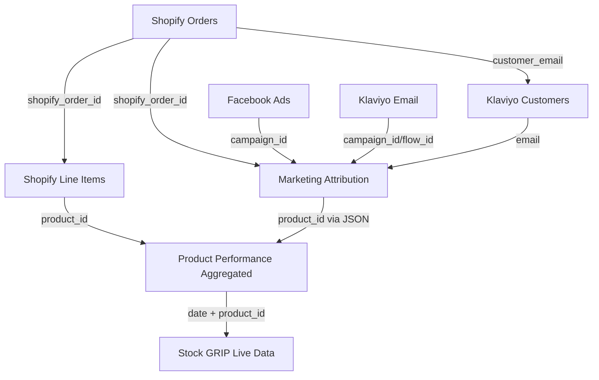

# Weld Join Strategies and CSV Export Specification

## Overview
This document provides comprehensive join strategies and CSV export specifications for implementing the Shopify, Facebook, and Klaviyo data integration in Weld. It defines how to connect the separate data models and export unified datasets for Stock GRIP inventory optimization.

## Data Model Relationships

### Primary Join Keys



### Join Key Specifications

| Source Table | Target Table | Join Key | Join Type | Notes |
|--------------|--------------|----------|-----------|-------|
| `shopify_orders` | `shopify_line_items` | `shopify_order_id` | 1:N | One order, multiple line items |
| `shopify_orders` | `marketing_attribution` | `shopify_order_id` | 1:1 | Optional attribution |
| `shopify_line_items` | `product_performance_aggregated` | `product_id` | N:1 | Multiple sales per product |
| `klaviyo_customers` | `marketing_attribution` | `email` | 1:N | Customer journey tracking |
| `facebook_ads_data` | `marketing_attribution` | `campaign_id` | 1:N | Campaign attribution |
| `klaviyo_email_data` | `marketing_attribution` | `campaign_id` OR `flow_id` | 1:N | Email attribution |

## Core Join Strategies

### 1. Complete Customer Journey Analysis

```sql
-- Unified customer journey with all touchpoints
WITH customer_orders AS (
  SELECT 
    so.shopify_order_id,
    so.customer_email,
    so.created_at as order_date,
    so.total_price as order_value,
    so.financial_status,
    -- Aggregate line items
    COUNT(sli.id) as items_count,
    SUM(sli.quantity) as total_units,
    ARRAY_AGG(sli.product_id) as products_purchased
  FROM shopify_orders so
  LEFT JOIN shopify_line_items sli ON so.shopify_order_id = sli.shopify_order_id
  WHERE so.created_at >= CURRENT_DATE - INTERVAL '90 days'
  GROUP BY so.shopify_order_id, so.customer_email, so.created_at, so.total_price, so.financial_status
),
customer_attribution AS (
  SELECT 
    ma.shopify_order_id,
    ma.customer_email,
    ma.first_touch_channel,
    ma.last_touch_channel,
    ma.facebook_attributed_revenue,
    ma.klaviyo_attributed_revenue,
    ma.touchpoint_count,
    ma.journey_duration_hours
  FROM marketing_attribution ma
),
customer_profiles AS (
  SELECT 
    kc.email,
    kc.total_orders as lifetime_orders,
    kc.total_spent as lifetime_value,
    kc.customer_segment,
    kc.lifecycle_stage,
    kc.email_engagement_score
  FROM klaviyo_customers kc
)
SELECT 
  co.shopify_order_id,
  co.customer_email,
  co.order_date,
  co.order_value,
  co.financial_status,
  co.items_count,
  co.total_units,
  co.products_purchased,
  
  -- Attribution data
  ca.first_touch_channel,
  ca.last_touch_channel,
  ca.facebook_attributed_revenue,
  ca.klaviyo_attributed_revenue,
  ca.touchpoint_count,
  ca.journey_duration_hours,
  
  -- Customer profile
  cp.lifetime_orders,
  cp.lifetime_value,
  cp.customer_segment,
  cp.lifecycle_stage,
  cp.email_engagement_score,
  
  -- Calculated metrics
  CASE 
    WHEN ca.facebook_attributed_revenue > 0 OR ca.klaviyo_attributed_revenue > 0 THEN 'attributed'
    ELSE 'organic'
  END as order_type,
  
  co.order_value / NULLIF(co.items_count, 0) as avg_item_value
FROM customer_orders co
LEFT JOIN customer_attribution ca ON co.shopify_order_id = ca.shopify_order_id
LEFT JOIN customer_profiles cp ON co.customer_email = cp.email
ORDER BY co.order_date DESC
```

### 2. Product Performance Unified View

```sql
-- Complete product performance across all channels
WITH shopify_product_sales AS (
  SELECT 
    DATE(so.created_at) as sale_date,
    sli.product_id,
    sli.title as product_name,
    sli.sku,
    SUM(sli.quantity) as units_sold,
    SUM(sli.quantity * sli.price) as revenue,
    COUNT(DISTINCT so.shopify_order_id) as order_count,
    AVG(sli.price) as avg_selling_price
  FROM shopify_orders so
  JOIN shopify_line_items sli ON so.shopify_order_id = sli.shopify_order_id
  WHERE so.financial_status = 'paid'
    AND so.created_at >= CURRENT_DATE - INTERVAL '30 days'
  GROUP BY DATE(so.created_at), sli.product_id, sli.title, sli.sku
),
facebook_product_performance AS (
  SELECT 
    fad.date,
    JSON_EXTRACT_PATH_TEXT(fad.attributed_products, '$.product_id') as product_id,
    SUM(fad.spend) as facebook_spend,
    SUM(fad.impressions) as facebook_impressions,
    SUM(fad.clicks) as facebook_clicks,
    SUM(fad.purchase_value) as facebook_attributed_revenue
  FROM facebook_ads_data fad
  WHERE fad.attributed_products IS NOT NULL
    AND fad.date >= CURRENT_DATE - INTERVAL '30 days'
  GROUP BY fad.date, JSON_EXTRACT_PATH_TEXT(fad.attributed_products, '$.product_id')
),
klaviyo_product_performance AS (
  SELECT 
    ked.date,
    JSON_EXTRACT_PATH_TEXT(ked.featured_products, '$.product_id') as product_id,
    SUM(ked.recipients) as email_recipients,
    SUM(ked.unique_opens) as email_opens,
    SUM(ked.unique_clicks) as email_clicks,
    SUM(ked.attributed_revenue) as email_attributed_revenue
  FROM klaviyo_email_data ked
  WHERE ked.featured_products IS NOT NULL
    AND ked.date >= CURRENT_DATE - INTERVAL '30 days'
  GROUP BY ked.date, JSON_EXTRACT_PATH_TEXT(ked.featured_products, '$.product_id')
)
SELECT 
  COALESCE(sps.sale_date, fpp.date, kpp.date) as performance_date,
  COALESCE(sps.product_id, fpp.product_id, kpp.product_id) as product_id,
  sps.product_name,
  sps.sku,
  
  -- Shopify metrics
  COALESCE(sps.units_sold, 0) as shopify_units_sold,
  COALESCE(sps.revenue, 0) as shopify_revenue,
  COALESCE(sps.order_count, 0) as shopify_orders,
  sps.avg_selling_price,
  
  -- Facebook metrics
  COALESCE(fpp.facebook_spend, 0) as facebook_spend,
  COALESCE(fpp.facebook_impressions, 0) as facebook_impressions,
  COALESCE(fpp.facebook_clicks, 0) as facebook_clicks,
  COALESCE(fpp.facebook_attributed_revenue, 0) as facebook_attributed_revenue,
  
  -- Klaviyo metrics
  COALESCE(kpp.email_recipients, 0) as email_recipients,
  COALESCE(kpp.email_opens, 0) as email_opens,
  COALESCE(kpp.email_clicks, 0) as email_clicks,
  COALESCE(kpp.email_attributed_revenue, 0) as email_attributed_revenue,
  
  -- Calculated performance metrics
  COALESCE(sps.revenue, 0) + COALESCE(fpp.facebook_attributed_revenue, 0) + COALESCE(kpp.email_attributed_revenue, 0) as total_revenue,
  CASE 
    WHEN COALESCE(fpp.facebook_spend, 0) > 0 THEN 
      COALESCE(fpp.facebook_attributed_revenue, 0) / fpp.facebook_spend 
    ELSE NULL 
  END as facebook_roas,
  CASE 
    WHEN COALESCE(kpp.email_recipients, 0) > 0 THEN 
      COALESCE(kpp.email_attributed_revenue, 0) / kpp.email_recipients 
    ELSE NULL 
  END as revenue_per_email_recipient
FROM shopify_product_sales sps
FULL OUTER JOIN facebook_product_performance fpp 
  ON sps.sale_date = fpp.date AND sps.product_id = fpp.product_id
FULL OUTER JOIN klaviyo_product_performance kpp 
  ON COALESCE(sps.sale_date, fpp.date) = kpp.date 
  AND COALESCE(sps.product_id, fpp.product_id) = kpp.product_id
ORDER BY performance_date DESC, total_revenue DESC
```

### 3. Marketing Attribution Complete View

```sql
-- Comprehensive marketing attribution analysis
WITH attribution_base AS (
  SELECT 
    ma.date,
    ma.shopify_order_id,
    ma.customer_email,
    ma.total_attributed_revenue,
    ma.first_touch_channel,
    ma.last_touch_channel,
    ma.touchpoint_count,
    ma.journey_duration_hours,
    
    -- Order details
    so.order_number,
    so.created_at as order_timestamp,
    so.total_price as order_total,
    so.customer_orders_count,
    
    -- Facebook attribution
    ma.facebook_campaign_id,
    ma.facebook_attributed_revenue,
    fad.campaign_name as facebook_campaign_name,
    fad.spend as facebook_daily_spend,
    fad.roas as facebook_campaign_roas,
    
    -- Klaviyo attribution
    ma.klaviyo_campaign_id,
    ma.klaviyo_flow_id,
    ma.klaviyo_attributed_revenue,
    ked.campaign_name as klaviyo_campaign_name,
    ked.flow_name as klaviyo_flow_name,
    ked.open_rate as klaviyo_open_rate,
    ked.click_rate as klaviyo_click_rate
  FROM marketing_attribution ma
  LEFT JOIN shopify_orders so ON ma.shopify_order_id = so.shopify_order_id
  LEFT JOIN facebook_ads_data fad ON ma.facebook_campaign_id = fad.campaign_id AND ma.date = fad.date
  LEFT JOIN klaviyo_email_data ked ON (ma.klaviyo_campaign_id = ked.campaign_id OR ma.klaviyo_flow_id = ked.flow_id) AND ma.date = ked.date
  WHERE ma.date >= CURRENT_DATE - INTERVAL '30 days'
)
SELECT 
  date,
  shopify_order_id,
  customer_email,
  order_number,
  order_timestamp,
  order_total,
  customer_orders_count,
  total_attributed_revenue,
  
  -- Journey characteristics
  first_touch_channel,
  last_touch_channel,
  touchpoint_count,
  journey_duration_hours,
  
  -- Facebook attribution details
  facebook_campaign_id,
  facebook_campaign_name,
  facebook_attributed_revenue,
  facebook_daily_spend,
  facebook_campaign_roas,
  
  -- Klaviyo attribution details
  klaviyo_campaign_id,
  klaviyo_flow_id,
  klaviyo_campaign_name,
  klaviyo_flow_name,
  klaviyo_attributed_revenue,
  klaviyo_open_rate,
  klaviyo_click_rate,
  
  -- Attribution analysis
  CASE 
    WHEN first_touch_channel = last_touch_channel THEN 'single_touch'
    ELSE 'multi_touch'
  END as attribution_complexity,
  
  ROUND((facebook_attributed_revenue / NULLIF(total_attributed_revenue, 0)) * 100, 2) as facebook_attribution_percentage,
  ROUND((klaviyo_attributed_revenue / NULLIF(total_attributed_revenue, 0)) * 100, 2) as klaviyo_attribution_percentage,
  
  -- Customer value indicators
  CASE 
    WHEN customer_orders_count = 1 THEN 'new_customer'
    WHEN customer_orders_count BETWEEN 2 AND 5 THEN 'returning_customer'
    ELSE 'loyal_customer'
  END as customer_type
FROM attribution_base
ORDER BY date DESC, total_attributed_revenue DESC
```

## CSV Export Specifications

### Export 1: Daily Sales Performance
**File**: `daily_sales_performance_YYYY-MM-DD.csv`

```sql
-- Daily sales performance export for Stock GRIP
SELECT 
  DATE(so.created_at) as sale_date,
  sli.product_id,
  sli.title as product_name,
  sli.sku,
  sli.vendor as brand,
  SUM(sli.quantity) as units_sold,
  SUM(sli.quantity * sli.price) as revenue_gbp,
  COUNT(DISTINCT so.shopify_order_id) as order_count,
  AVG(sli.price) as avg_unit_price_gbp,
  SUM(sli.total_discount) as total_discounts_gbp,
  
  -- Customer metrics
  COUNT(DISTINCT so.customer_email) as unique_customers,
  AVG(so.customer_orders_count) as avg_customer_order_history,
  
  -- Geographic distribution
  so.shipping_country,
  COUNT(*) as country_order_count,
  
  -- Marketing attribution (if available)
  COALESCE(SUM(ma.facebook_attributed_revenue), 0) as facebook_attributed_revenue_gbp,
  COALESCE(SUM(ma.klaviyo_attributed_revenue), 0) as email_attributed_revenue_gbp,
  
  -- Calculated metrics
  SUM(sli.quantity * sli.price) - COALESCE(SUM(ma.facebook_attributed_revenue), 0) - COALESCE(SUM(ma.klaviyo_attributed_revenue), 0) as organic_revenue_gbp
FROM shopify_orders so
JOIN shopify_line_items sli ON so.shopify_order_id = sli.shopify_order_id
LEFT JOIN marketing_attribution ma ON so.shopify_order_id = ma.shopify_order_id
WHERE so.financial_status = 'paid'
  AND so.created_at >= CURRENT_DATE - INTERVAL '1 day'
  AND so.created_at < CURRENT_DATE
GROUP BY 
  DATE(so.created_at), 
  sli.product_id, 
  sli.title, 
  sli.sku, 
  sli.vendor,
  so.shipping_country
ORDER BY sale_date DESC, revenue_gbp DESC
```

### Export 2: Marketing Performance Summary
**File**: `marketing_performance_summary_YYYY-MM-DD.csv`

```sql
-- Marketing performance summary export
WITH daily_performance AS (
  SELECT 
    fad.date,
    'facebook' as channel,
    fad.campaign_id as campaign_identifier,
    fad.campaign_name,
    NULL as flow_name,
    SUM(fad.spend) as spend_gbp,
    SUM(fad.impressions) as impressions,
    SUM(fad.clicks) as clicks,
    SUM(fad.purchase_value) as attributed_revenue_gbp,
    SUM(fad.purchases) as attributed_conversions,
    AVG(fad.roas) as roas
  FROM facebook_ads_data fad
  WHERE fad.date >= CURRENT_DATE - INTERVAL '7 days'
  GROUP BY fad.date, fad.campaign_id, fad.campaign_name
  
  UNION ALL
  
  SELECT 
    ked.date,
    'email' as channel,
    COALESCE(ked.campaign_id, ked.flow_id) as campaign_identifier,
    COALESCE(ked.campaign_name, ked.flow_name) as campaign_name,
    ked.flow_name,
    0 as spend_gbp,  -- Email marketing typically has no direct spend
    0 as impressions,
    ked.unique_clicks as clicks,
    ked.attributed_revenue as attributed_revenue_gbp,
    ked.attributed_orders as attributed_conversions,
    CASE 
      WHEN ked.recipients > 0 THEN ked.attributed_revenue / ked.recipients * 1000  -- Revenue per 1000 recipients
      ELSE 0 
    END as roas
  FROM klaviyo_email_data ked
  WHERE ked.date >= CURRENT_DATE - INTERVAL '7 days'
)
SELECT 
  date,
  channel,
  campaign_identifier,
  campaign_name,
  flow_name,
  spend_gbp,
  impressions,
  clicks,
  attributed_revenue_gbp,
  attributed_conversions,
  roas,
  
  -- Calculated metrics
  CASE 
    WHEN clicks > 0 THEN spend_gbp / clicks 
    ELSE 0 
  END as cost_per_click_gbp,
  
  CASE 
    WHEN attributed_conversions > 0 THEN spend_gbp / attributed_conversions 
    ELSE 0 
  END as cost_per_acquisition_gbp,
  
  CASE 
    WHEN impressions > 0 THEN (clicks::FLOAT / impressions) * 100 
    ELSE 0 
  END as click_through_rate_percentage
FROM daily_performance
ORDER BY date DESC, attributed_revenue_gbp DESC
```

### Export 3: Customer Lifecycle Analysis
**File**: `customer_lifecycle_analysis_YYYY-MM-DD.csv`

```sql
-- Customer lifecycle and segmentation export
WITH customer_metrics AS (
  SELECT 
    kc.email,
    kc.first_name,
    kc.last_name,
    kc.customer_segment,
    kc.lifecycle_stage,
    kc.total_orders,
    kc.total_spent as lifetime_value_gbp,
    kc.average_order_value as avg_order_value_gbp,
    kc.email_engagement_score,
    kc.last_order_date,
    kc.first_order_date,
    
    -- Recent order activity
    COUNT(CASE WHEN so.created_at >= CURRENT_DATE - INTERVAL '30 days' THEN 1 END) as orders_last_30_days,
    SUM(CASE WHEN so.created_at >= CURRENT_DATE - INTERVAL '30 days' THEN so.total_price ELSE 0 END) as revenue_last_30_days_gbp,
    
    -- Attribution analysis
    COUNT(CASE WHEN ma.first_touch_channel = 'facebook' THEN 1 END) as facebook_first_touch_count,
    COUNT(CASE WHEN ma.first_touch_channel = 'email' THEN 1 END) as email_first_touch_count,
    COUNT(CASE WHEN ma.last_touch_channel = 'facebook' THEN 1 END) as facebook_last_touch_count,
    COUNT(CASE WHEN ma.last_touch_channel = 'email' THEN 1 END) as email_last_touch_count,
    
    AVG(ma.journey_duration_hours) as avg_journey_duration_hours,
    AVG(ma.touchpoint_count) as avg_touchpoints_per_journey
  FROM klaviyo_customers kc
  LEFT JOIN shopify_orders so ON kc.email = so.customer_email
  LEFT JOIN marketing_attribution ma ON kc.email = ma.customer_email
  GROUP BY 
    kc.email, kc.first_name, kc.last_name, kc.customer_segment, kc.lifecycle_stage,
    kc.total_orders, kc.total_spent, kc.average_order_value, kc.email_engagement_score,
    kc.last_order_date, kc.first_order_date
)
SELECT 
  email,
  first_name,
  last_name,
  customer_segment,
  lifecycle_stage,
  total_orders,
  lifetime_value_gbp,
  avg_order_value_gbp,
  email_engagement_score,
  last_order_date,
  first_order_date,
  orders_last_30_days,
  revenue_last_30_days_gbp,
  
  -- Attribution preferences
  facebook_first_touch_count,
  email_first_touch_count,
  facebook_last_touch_count,
  email_last_touch_count,
  avg_journey_duration_hours,
  avg_touchpoints_per_journey,
  
  -- Customer insights
  CURRENT_DATE - last_order_date as days_since_last_order,
  CURRENT_DATE - first_order_date as customer_age_days,
  
  CASE 
    WHEN orders_last_30_days > 0 THEN 'active'
    WHEN CURRENT_DATE - last_order_date <= 60 THEN 'recent'
    WHEN CURRENT_DATE - last_order_date <= 180 THEN 'at_risk'
    ELSE 'churned'
  END as activity_status,
  
  -- Preferred channel analysis
  CASE 
    WHEN facebook_first_touch_count > email_first_touch_count THEN 'facebook_driven'
    WHEN email_first_touch_count > facebook_first_touch_count THEN 'email_driven'
    WHEN facebook_first_touch_count = email_first_touch_count AND facebook_first_touch_count > 0 THEN 'multi_channel'
    ELSE 'organic'
  END as acquisition_channel_preference
FROM customer_metrics
WHERE total_orders > 0  -- Only customers with purchase history
ORDER BY lifetime_value_gbp DESC
```

### Export 4: Product Inventory Optimization
**File**: `product_inventory_optimization_YYYY-MM-DD.csv`

```sql
-- Product inventory optimization export for Stock GRIP
WITH product_performance AS (
  SELECT 
    ppa.product_id,
    MAX(ppa.product_name) as product_name,
    MAX(ppa.product_category) as category,
    MAX(ppa.product_sku) as sku,
    
    -- Recent performance (last 30 days)
    AVG(CASE WHEN ppa.date >= CURRENT_DATE - INTERVAL '30 days' THEN ppa.total_units_sold END) as avg_daily_units_last_30d,
    SUM(CASE WHEN ppa.date >= CURRENT_DATE - INTERVAL '30 days' THEN ppa.total_product_revenue END) as revenue_last_30d_gbp,
    AVG(CASE WHEN ppa.date >= CURRENT_DATE - INTERVAL '30 days' THEN ppa.marketing_roas END) as avg_roas_last_30d,
    
    -- Historical performance (30-90 days ago)
    AVG(CASE WHEN ppa.date BETWEEN CURRENT_DATE - INTERVAL '90 days' AND CURRENT_DATE - INTERVAL '30 days' 
             THEN ppa.total_units_sold END) as avg_daily_units_historical,
    
    -- Current inventory status
    MAX(CASE WHEN ppa.date = CURRENT_DATE - INTERVAL '1 day' THEN ppa.inventory_level END) as current_inventory_level,
    MAX(CASE WHEN ppa.date = CURRENT_DATE - INTERVAL '1 day' THEN ppa.inventory_cost END) as current_inventory_cost_gbp,
    
    -- Marketing performance
    AVG(ppa.total_marketing_spend) as avg_daily_marketing_spend_gbp,
    AVG(ppa.facebook_roas) as avg_facebook_roas,
    AVG(ppa.revenue_per_email_gbp) as avg_email_revenue_per_send,
    
    -- Demand patterns
    STDDEV(ppa.total_units_sold) as demand_volatility,
    MAX(ppa.total_units_sold) as peak_daily_demand,
    COUNT(CASE WHEN ppa.total_units_sold > 0 THEN 1 END) as days_with_sales,
    
    -- Profitability
    AVG(ppa.net_profit_gbp) as avg_daily_profit_gbp,
    AVG(ppa.net_profit_margin) as avg_profit_margin
  FROM product_performance_aggregated ppa
  WHERE ppa.date >= CURRENT_DATE - INTERVAL '90 days'
  GROUP BY ppa.product_id
)
SELECT 
  product_id,
  product_name,
  category,
  sku,
  current_inventory_level,
  current_inventory_cost_gbp,
  
  -- Demand metrics
  COALESCE(avg_daily_units_last_30d, 0) as avg_daily_demand_recent,
  COALESCE(avg_daily_units_historical, 0) as avg_daily_demand_historical,
  demand_volatility,
  peak_daily_demand,
  days_with_sales,
  
  -- Financial performance
  revenue_last_30d_gbp,
  avg_daily_profit_gbp,
  avg_profit_margin,
  avg_daily_marketing_spend_gbp,
  
  -- Marketing effectiveness
  avg_roas_last_30d,
  avg_facebook_roas,
  avg_email_revenue_per_send,
  
  -- Inventory optimization metrics
  CASE 
    WHEN avg_daily_units_last_30d > 0 THEN 
      current_inventory_level / avg_daily_units_last_30d 
    ELSE NULL 
  END as days_of_inventory_remaining,
  
  -- Demand trend
  CASE 
    WHEN avg_daily_units_last_30d > avg_daily_units_historical * 1.2 THEN 'increasing'
    WHEN avg_daily_units_last_30d < avg_daily_units_historical * 0.8 THEN 'decreasing'
    ELSE 'stable'
  END as demand_trend,
  
  -- Inventory recommendation
  CASE 
    WHEN current_inventory_level / NULLIF(avg_daily_units_last_30d, 0) < 7 AND avg_roas_last_30d > 2.0 THEN 'increase_stock'
    WHEN current_inventory_level / NULLIF(avg_daily_units_last_30d, 0) > 60 AND avg_roas_last_30d < 1.5 THEN 'reduce_stock'
    WHEN demand_volatility > avg_daily_units_last_30d * 0.5 THEN 'monitor_closely'
    ELSE 'maintain_current'
  END as inventory_recommendation,
  
  -- Marketing recommendation
  CASE 
    WHEN avg_roas_last_30d > 3.0 AND avg_daily_units_last_30d > 0 THEN 'increase_marketing'
    WHEN avg_roas_last_30d < 1.5 THEN 'reduce_marketing'
    WHEN avg_roas_last_30d BETWEEN 1.5 AND 3.0 THEN 'optimize_marketing'
    ELSE 'no_marketing_data'
  END as marketing_recommendation
FROM product_performance
WHERE days_with_sales >= 5  -- Products with meaningful sales history
ORDER BY revenue_last_30d_gbp DESC
```

## CSV Export Configuration

### File Format Standards

| Setting | Value | Notes |
|---------|-------|-------|
| **Encoding** | UTF-8 | Ensures proper character handling |
| **Delimiter** | Comma (,) | Standard CSV format |
| **Quote Character** | Double quote (") | For fields containing commas |
| **Header Row** | Yes | Column names in first row |
| **Date Format** | YYYY-MM-DD | ISO 8601 standard |
| **DateTime Format** | YYYY-MM-DDTHH:MM:SSZ | ISO 8601 with timezone |
| **Currency Precision** | 2 decimal places | £12.34 format |
| **Rate Precision** | 4 decimal places | 0.1234 format |
| **Null Values** | Empty string | For optional fields |
| **Boolean Values** | true/false | Lowercase |

### File Naming Conventions

```
# Daily exports
{data_type}_{YYYY-MM-DD}.csv

# Weekly exports  
{data_type}_weekly_{YYYY-WW}.csv

# Monthly exports
{data_type}_monthly_{YYYY-MM}.csv

# Examples:
daily_sales_performance_2024-03-15.csv
marketing_performance_summary_2024-03-15.csv
customer_lifecycle_analysis_2024-03-15.csv
product_inventory_optimization_2024-03-15.csv
```

### Export Schedule Recommendations

| Export Type | Frequency | Best Time (UTC) | Dependencies |
|-------------|-----------|-----------------|--------------|
| Daily Sales Performance | Daily | 02:00 | Shopify data sync complete |
| Marketing Performance | Daily | 03:00 | Facebook/Klaviyo APIs updated |
| Customer Lifecycle | Weekly | Sunday 04:00 | All data sources synced |
| Product Inventory | Daily | 05:00 | All performance data ready |

## Data Quality Validation

### Pre-Export Validation Checks

```sql
-- Data quality validation before export
WITH validation_checks AS (
  SELECT 
    'shopify_orders' as table_name,
    COUNT(*) as total_records,
    COUNT(CASE WHEN shopify_order_id IS NULL THEN 1 END) as missing_primary_key,
    COUNT(CASE WHEN total_price < 0 THEN 1 END) as invalid_values,
    MAX(created_at) as latest_record_date
  FROM shopify_orders
  WHERE created_at >= CURRENT_DATE - INTERVAL '7 days'
  
  UNION ALL
  
  SELECT 
    'facebook_ads_data' as table_name,
    COUNT(*) as total_records,
    COUNT(CASE WHEN campaign_id IS NULL THEN 1 END) as missing_primary_key,
    COUNT(CASE WHEN spend < 0 OR roas > 50 THEN 1 END) as invalid_values,
    MAX(date) as latest_record_date
  FROM facebook_ads_data
  WHERE date >= CURRENT_DATE - INTERVAL '7 days'
  
  
  UNION ALL
  
  SELECT 
    'klaviyo_email_data' as table_name,
    COUNT(*) as total_records,
    COUNT(CASE WHEN (campaign_id IS NULL AND flow_id IS NULL) THEN 1 END) as missing_primary_key,
    COUNT(CASE WHEN open_rate > 100 OR click_rate > 100 THEN 1 END) as invalid_values,
    MAX(date) as latest_record_date
  FROM klaviyo_email_data
  WHERE date >= CURRENT_DATE - INTERVAL '7 days'
)
SELECT 
  table_name,
  total_records,
  missing_primary_key,
  invalid_values,
  latest_record_date,
  CASE 
    WHEN missing_primary_key > 0 OR invalid_values > total_records * 0.05 THEN 'FAIL'
    WHEN latest_record_date < CURRENT_DATE - INTERVAL '2 days' THEN 'STALE'
    ELSE 'PASS'
  END as validation_status
FROM validation_checks
ORDER BY table_name;
```

### Post-Export Validation

```sql
-- Validate exported data completeness
WITH export_validation AS (
  SELECT 
    'daily_sales_performance' as export_name,
    COUNT(*) as record_count,
    SUM(revenue_gbp) as total_revenue,
    COUNT(DISTINCT product_id) as unique_products,
    MIN(sale_date) as earliest_date,
    MAX(sale_date) as latest_date
  FROM daily_sales_performance_export
  
  UNION ALL
  
  SELECT 
    'marketing_performance_summary' as export_name,
    COUNT(*) as record_count,
    SUM(attributed_revenue_gbp) as total_revenue,
    COUNT(DISTINCT campaign_identifier) as unique_campaigns,
    MIN(date) as earliest_date,
    MAX(date) as latest_date
  FROM marketing_performance_summary_export
)
SELECT 
  export_name,
  record_count,
  total_revenue,
  unique_products,
  earliest_date,
  latest_date,
  CASE 
    WHEN record_count = 0 THEN 'NO_DATA'
    WHEN total_revenue <= 0 THEN 'ZERO_REVENUE'
    WHEN latest_date < CURRENT_DATE - INTERVAL '1 day' THEN 'STALE_DATA'
    ELSE 'VALID'
  END as export_status
FROM export_validation;
```

## Performance Optimization

### Weld Query Optimization

#### 1. Indexing Strategy
```sql
-- Recommended indexes for optimal join performance
CREATE INDEX CONCURRENTLY idx_shopify_orders_customer_date 
ON shopify_orders (customer_email, created_at);

CREATE INDEX CONCURRENTLY idx_shopify_line_items_product_order 
ON shopify_line_items (product_id, shopify_order_id);

CREATE INDEX CONCURRENTLY idx_marketing_attribution_customer_date 
ON marketing_attribution (customer_email, date);

CREATE INDEX CONCURRENTLY idx_facebook_ads_campaign_date 
ON facebook_ads_data (campaign_id, date);

CREATE INDEX CONCURRENTLY idx_klaviyo_email_campaign_date 
ON klaviyo_email_data (campaign_id, date);

CREATE INDEX CONCURRENTLY idx_product_performance_product_date 
ON product_performance_aggregated (product_id, date);
```

#### 2. Partitioning Strategy
```sql
-- Partition large tables by date for better performance
ALTER TABLE shopify_orders 
PARTITION BY RANGE (created_at);

ALTER TABLE facebook_ads_data 
PARTITION BY RANGE (date);

ALTER TABLE klaviyo_email_data 
PARTITION BY RANGE (date);

ALTER TABLE marketing_attribution 
PARTITION BY RANGE (date);

-- Create monthly partitions
CREATE TABLE shopify_orders_2024_03 
PARTITION OF shopify_orders 
FOR VALUES FROM ('2024-03-01') TO ('2024-04-01');
```

#### 3. Materialized Views for Common Joins
```sql
-- Materialized view for daily product performance
CREATE MATERIALIZED VIEW mv_daily_product_performance AS
SELECT 
  DATE(so.created_at) as performance_date,
  sli.product_id,
  sli.title as product_name,
  SUM(sli.quantity) as units_sold,
  SUM(sli.quantity * sli.price) as revenue,
  COUNT(DISTINCT so.shopify_order_id) as order_count,
  COALESCE(SUM(ma.facebook_attributed_revenue), 0) as facebook_revenue,
  COALESCE(SUM(ma.klaviyo_attributed_revenue), 0) as email_revenue
FROM shopify_orders so
JOIN shopify_line_items sli ON so.shopify_order_id = sli.shopify_order_id
LEFT JOIN marketing_attribution ma ON so.shopify_order_id = ma.shopify_order_id
WHERE so.financial_status = 'paid'
GROUP BY DATE(so.created_at), sli.product_id, sli.title;

-- Refresh schedule
CREATE OR REPLACE FUNCTION refresh_daily_product_performance()
RETURNS void AS $$
BEGIN
  REFRESH MATERIALIZED VIEW CONCURRENTLY mv_daily_product_performance;
END;
$$ LANGUAGE plpgsql;

-- Schedule refresh every 6 hours
SELECT cron.schedule('refresh-product-performance', '0 */6 * * *', 'SELECT refresh_daily_product_performance();');
```

### Memory Management

#### Batch Processing Configuration
```sql
-- Configure Weld for optimal batch processing
SET work_mem = '256MB';
SET shared_buffers = '1GB';
SET effective_cache_size = '4GB';
SET random_page_cost = 1.1;

-- For large exports, process in chunks
WITH RECURSIVE date_chunks AS (
  SELECT CURRENT_DATE - INTERVAL '30 days' as start_date, CURRENT_DATE - INTERVAL '23 days' as end_date
  UNION ALL
  SELECT end_date, end_date + INTERVAL '7 days'
  FROM date_chunks
  WHERE end_date < CURRENT_DATE
)
SELECT * FROM daily_sales_performance_query
WHERE sale_date BETWEEN start_date AND end_date;
```

## Error Handling and Monitoring

### Export Monitoring Dashboard

```sql
-- Export monitoring query
WITH export_metrics AS (
  SELECT 
    'daily_sales_performance' as export_type,
    COUNT(*) as record_count,
    MAX(created_at) as last_export_time,
    SUM(CASE WHEN validation_status = 'PASS' THEN 1 ELSE 0 END) as successful_records
  FROM export_log
  WHERE export_date >= CURRENT_DATE - INTERVAL '7 days'
  GROUP BY export_type
)
SELECT 
  export_type,
  record_count,
  last_export_time,
  successful_records,
  ROUND((successful_records::FLOAT / record_count) * 100, 2) as success_rate_percentage,
  CASE 
    WHEN last_export_time < CURRENT_DATE - INTERVAL '25 hours' THEN 'OVERDUE'
    WHEN success_rate_percentage < 95 THEN 'QUALITY_ISSUE'
    ELSE 'HEALTHY'
  END as export_health_status
FROM export_metrics
ORDER BY export_type;
```

### Automated Alerts

```sql
-- Alert conditions for export monitoring
SELECT 
  CASE 
    WHEN COUNT(*) = 0 THEN 'CRITICAL: No exports generated today'
    WHEN AVG(record_count) < (SELECT AVG(record_count) * 0.5 FROM export_log WHERE export_date >= CURRENT_DATE - INTERVAL '7 days') 
         THEN 'WARNING: Export volume significantly lower than average'
    WHEN MAX(error_count) > 0 THEN 'ERROR: Export errors detected'
    ELSE 'OK: All exports healthy'
  END as alert_message,
  COUNT(*) as exports_today,
  SUM(record_count) as total_records_today,
  SUM(error_count) as total_errors_today
FROM export_log
WHERE export_date = CURRENT_DATE;
```

## Integration with Stock GRIP

### Final CSV Format for Stock GRIP Ingestion

```sql
-- Stock GRIP optimized export format
SELECT 
  -- Core identifiers
  performance_date as date,
  product_id,
  product_name,
  category,
  
  -- Demand signals
  avg_daily_demand_recent as demand_velocity,
  demand_volatility as demand_uncertainty,
  days_with_sales as demand_frequency,
  
  -- Marketing influence
  avg_roas_last_30d as marketing_efficiency,
  avg_daily_marketing_spend_gbp as marketing_investment,
  
  -- Financial metrics
  revenue_last_30d_gbp as recent_revenue,
  avg_daily_profit_gbp as profitability,
  avg_profit_margin as margin,
  
  -- Inventory constraints
  current_inventory_level as stock_level,
  days_of_inventory_remaining as stock_days,
  inventory_recommendation as stock_action,
  
  -- Optimization flags
  CASE 
    WHEN demand_trend = 'increasing' AND avg_roas_last_30d > 2.0 THEN 1 
    ELSE 0 
  END as high_growth_flag,
  
  CASE 
    WHEN days_of_inventory_remaining < 7 THEN 1 
    ELSE 0 
  END as stockout_risk_flag,
  
  CASE 
    WHEN avg_roas_last_30d > 3.0 THEN 1 
    ELSE 0 
  END as high_roi_flag
FROM product_inventory_optimization_export
WHERE days_with_sales >= 3  -- Minimum sales history for optimization
ORDER BY recent_revenue DESC;
```

## Summary

This comprehensive Weld join strategy and CSV export specification provides:

1. **Complete Data Integration**: Unified views across Shopify, Facebook, and Klaviyo
2. **Optimized Performance**: Indexing, partitioning, and materialized views
3. **Production-Ready Exports**: Four key CSV exports for different use cases
4. **Data Quality Assurance**: Validation checks and monitoring
5. **Stock GRIP Integration**: Optimized format for inventory optimization
6. **Scalable Architecture**: Designed for high-volume data processing

The system enables comprehensive marketing attribution analysis while providing the structured data feeds necessary for Stock GRIP's GP-EIMS and MPC-RL-MOBO optimization algorithms.